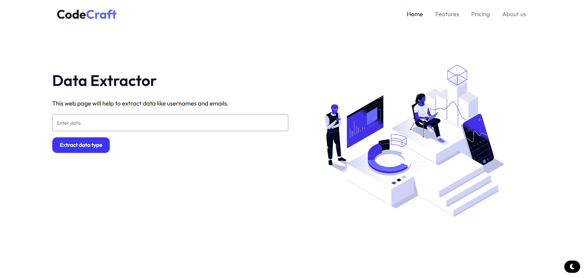
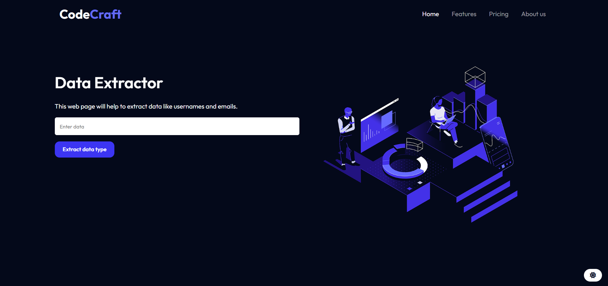

# Overview

## Descripción
This is actually a really old but interesting project I wanted to bring to live.

## Tecnologías Utilizadas

- **HTML5**: Estructura de la página.
- **CSS3**: Estilo y diseño visual.
- **JavaScript**: Lógica de detección de datos usando expresiones regulares (RegEx).
